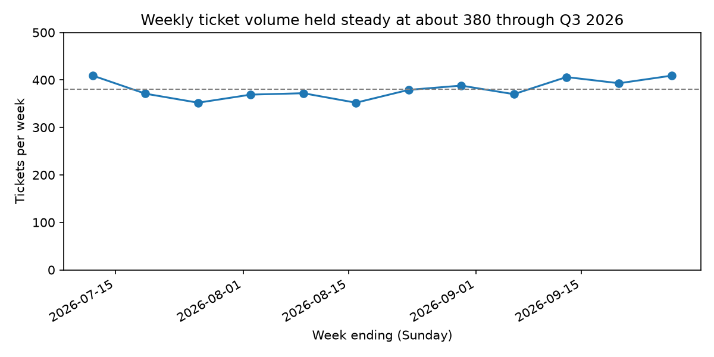
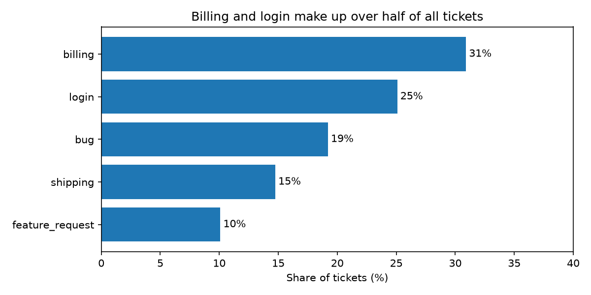

# support-assistant

A customer-support ticket classifier and answerer, built one day at a time as the capstone of a 15-week ML engineering bootcamp.

**Where it is now (end of Week 2):** the data layer. Tickets can be loaded, validated, cleaned, generated at scale and summarised, and each of those is covered by tests. No model yet — that starts in Week 4.

## Set up

Needs [uv](https://docs.astral.sh/uv/) and git.

```bash
git clone https://github.com/Ifuwelemuel/support-assistant.git
cd support-assistant
uv sync
uv run pytest
```

The last command should end with `37 passed`.

## What you can run

| Command | What it does |
|---|---|
| `uv run python -m support_assistant.data` | Validates the 12-ticket sample in `data/sample/` |
| `uv run python -m support_assistant.analysis` | Writes a text summary to `reports/summary.txt` |
| `uv run python -m support_assistant.synth` | Writes 5,000 synthetic tickets to `data/raw/` (seed 42: the same file every time) |

`data/raw/` and `reports/` are not in git; both are regenerated by the commands above.

## What the data looks like

Both figures are drawn by `notebooks/05_plots.ipynb` from the synthetic tickets. They describe the generator, not a real support desk.





## Layout

| Path | Contents |
|---|---|
| `src/support_assistant/analysis.py` | `Ticket` class; counting, filtering, top words, text report |
| `src/support_assistant/data.py` | Validating loader, six cleaning rules, `category_shares` |
| `src/support_assistant/synth.py` | Seeded synthetic ticket generator |
| `tests/` | 37 tests |
| `notebooks/` | Exploration; outputs are cleared before every commit |
| `data/sample/` | 12 tidy tickets and a deliberately messy copy |

## Progress

| Week | Theme | State |
|---|---|---|
| 1 | Python by hand | done — 19 tests |
| 2 | pandas, notebooks, real-data habits | done — 37 tests |
| 3 | ruff, pre-commit, Docker, CI | next |


| `make hooks` | Runs every pre-commit hook on every file |

Git hooks (see `.pre-commit-config.yaml`) check each commit: whitespace, valid YAML/TOML, no large files, no private keys, and ruff. A fixer hook repairs the file and stops the commit; look at `git diff`, then `git add` and commit again.


| `make api` | Runs the API on this machine at http://localhost:8000 (docs at `/docs`) |
| `make image` | Builds the Docker image from `Dockerfile`, installing exactly what `uv.lock` pins |
| `make serve` | Builds the image and runs the API in a container on port 8000; check it with `curl localhost:8000/health` |

| `src/support_assistant/api.py` | FastAPI application; `/health` endpoint |


| `.github/workflows/ci.yml` | CI: runs `make lint` and `make test` on every pull request and on `main` |

Every pull request is checked by GitHub Actions on a clean Linux machine. `main` is protected: changes arrive only through pull requests, and only when both checks, `lint` and `test`, have passed.
